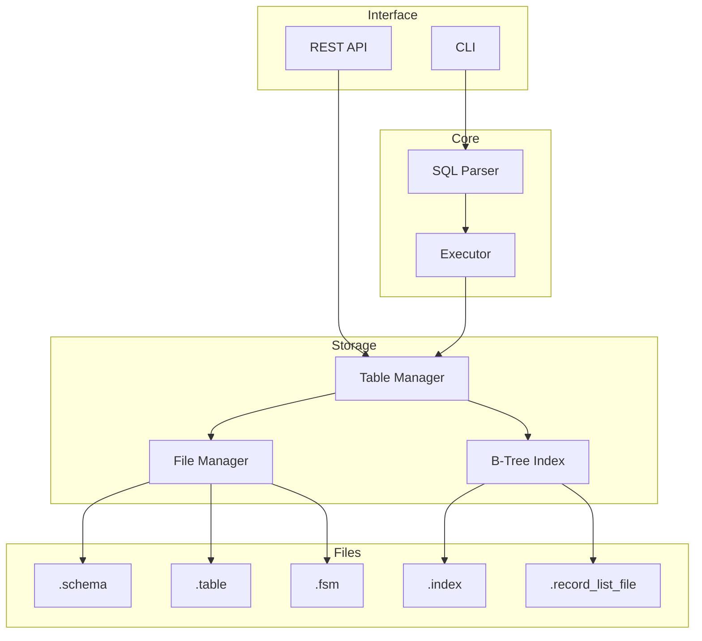

# RDBMS

A relational database management system built from scratch in Go. This project implements core database concepts including page-based storage, B-Tree indexing, SQL parsing, and both CLI and REST API interfaces.

## 🤖 AI Assistance Disclosure

This project was built as a learning exercise. The following components were developed with AI assistance:
- **CLI interface** — command-line REPL and output formatting
- **SQL parsing layer** — query parsing using sqlparser library
- **API validation** — request/response handling and validation

**Core components built manually:**
- B-Tree indexing implementation
- Page-based storage engine (8KB pages)
- Binary serialization/deserialization
- File management and FSM (Free Space Map)

## Features

- **Storage Engine** — Page-based storage with 8KB pages
- **B-Tree Indexing** — Automatic indexing for INT columns
- **SQL Support** — CREATE TABLE, INSERT, SELECT, UPDATE, DELETE
- **Data Types** — INT, VARCHAR(n), FLOAT, DATE, TIMESTAMP, JSON
- **Dual Interface** — CLI for interactive use, REST API for applications

## How To Use

### Prerequisites
- Go 1.21+

### Installation

```bash
git clone git@github.com:mirzokhidbro/mini-db.git
cd mini-db
go mod download
```

### Run CLI

```bash
go run cmd/cli/main.go
```

```
RDBMS CLI v1.0
Type 'exit' to quit, 'help' for commands

rdbms> CREATE TABLE users (id INT INDEX, name VARCHAR(50), age INT);
Table 'users' created

rdbms> INSERT INTO users (id, name, age) VALUES (1, 'John', 25);
1 row(s) inserted

rdbms> SELECT * FROM users;
| id | name | age |
+----+------+-----+
| 1  | John | 25  |
(1 rows)
```

### Run API Server

```bash
go run cmd/main.go
```

Server starts at `http://localhost:8000`

#### API Endpoints

| Method | Endpoint | Description |
|--------|----------|-------------|
| POST | `/api/v1/tables/create-table` | Create a new table |
| POST | `/api/v1/records/insert` | Insert a record |
| POST | `/api/v1/records/query` | Query records |
| POST | `/api/v1/records/update` | Update records |
| POST | `/api/v1/records/delete` | Delete records |

📖 **[Full API Documentation](./docs/api.md)**

## Architecture



### How It Works

**Page-Based Storage**

Each table stores data in 8KB pages. A page contains:
- Header (record count, free space pointer)
- Item pointers (offset + length for each record)
- Actual record data (grows from end of page)

**B-Tree Indexing**

When you create a column with `INDEX`, the system creates a B-Tree index file. On INSERT, the value is added to the B-Tree with a pointer to the record location (page ID + record ID). SELECT queries with WHERE on indexed columns use the B-Tree for O(log n) lookups instead of full table scans.

**File Structure**

For a table named `users`:
- `users.schema` — column definitions (name, type, length, indexed)
- `users.table` — actual row data in pages
- `users.fsm` — free space map for finding pages with space
- `users_id.index` — B-Tree index for `id` column (if indexed)
- `users_id.record_list_file` — linked list of record locations for duplicate index values

## License

MIT
